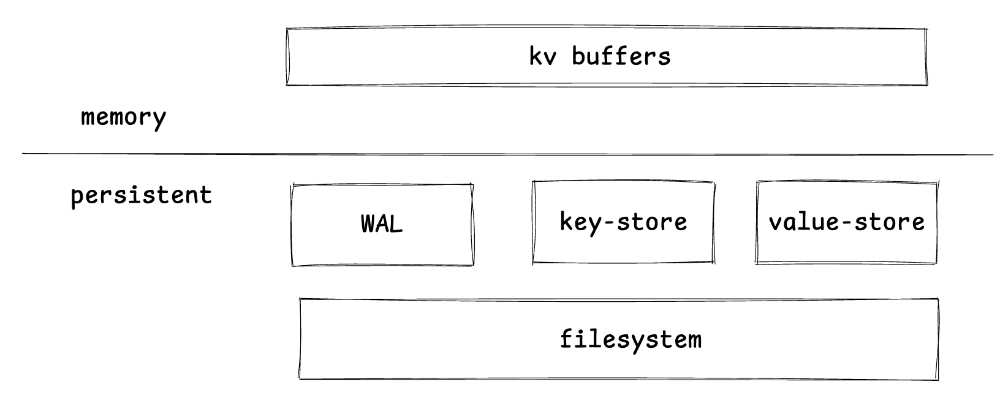
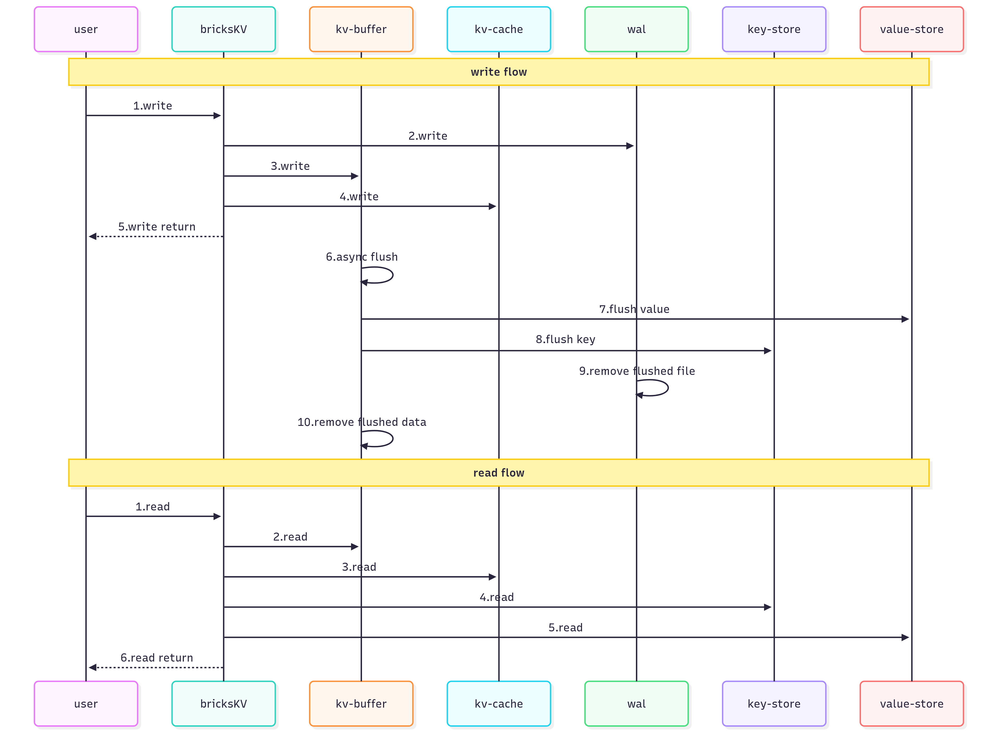
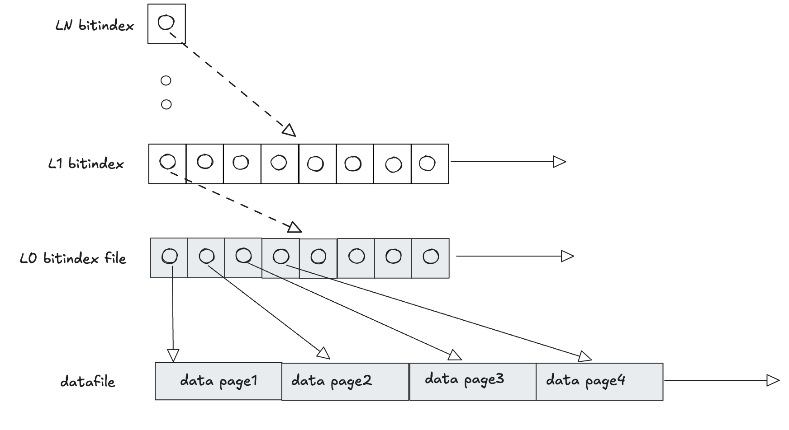
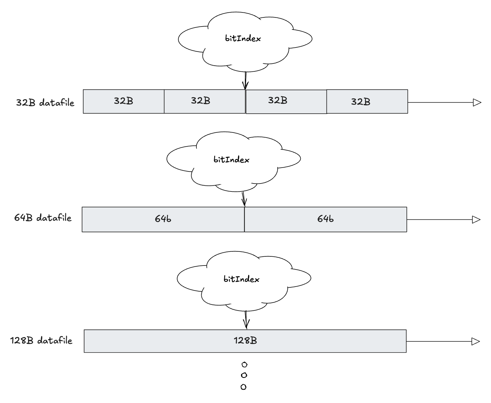

## 介绍

bricksKV是一个使用Rust实现的高性能kv存储引擎。用一句话来类比，bricksKV是一个disk版本的ConcurrentHashMap，支持串行写，并发读，读能做到O(1)时间复杂度。

核心设计思路在于将key和value分离存储：

1. key根据hash分桶存储在不同的索引文件中，索引会存储key以及value的存储位置。
2. value根据长度大小匹配存储到支持不同固定长度的分级文件中（比如支持数据项为32Byte，64Byte等不同分级文件）。每个value会有一个存储位置标识，存储到上述key的索引中，读的时候，只需要根据key的hash值，定位到对应的分桶，然后根据value的位置标识id，定位到对应的value存储文件，然后读取value。

## 设计哲学

* key存储：leveldb为什么读慢，因为它定位到key太慢了，首先它得找到key所在的层，然后再找到对应的文件，然后再打开文件从文件的索引读取到对应的位置，然后读取value，如果该层找不到继续往下层找。
  所以想到能不能用hashmap的方式来存储key，内存中的hashmap使用数组和链表实现的，文件存储层肯定不太好这样实现，那就直接从hash到的下标往后最多找比如32次来做hash碰撞的处理。hash碰撞处理失败的时候则扩容。然后可以用多个分桶比如8192个桶来降低hash碰撞处理失败的概率和降低扩容的频率。
* value存储：leveldb的写放大，包括很多存储需要shrink或merge的原因是值的长度是变长的，资源管理不方便。shrink或merge会增加系统负载和运维难度。如果值的长度是定长的那么就能很好做到资源管理，虽然现实是值长度往往不固定，但是可以用多级不同长度的数据页来解决，只不过会有一定的存储空间浪费。每级文件存储不同长度的数据，比如32B、64B、128B、256B、512B、1024B、2048B、4096B等不同长度级别。
每级文件都用多级bitmap来管理数据页的分配占有和释放，每层bitmap索引的一个bit管理下一层bitmap的8个bit，bit为0表示有空闲位，bit为1表示无空闲位。

## 架构

持久层：
* wal: 预写日志，负责以追加的方式快速持久化把kv到文件中和系统崩溃数据恢复。
* key-store：键存储，负责以分桶的方式存储键。
* value-store：值存储，以值长度分级存储到管理不同长度的数据页文件中。

内存层：

* kv-buffer：kv缓冲，负责把用户写入的kv数据先完整缓存到内存中。
* kv-cache： kv缓存，缓存持久层的kv数据，可配置缓存大小提升效率。

## 核心流程

* 写流程：先持久化到wal，然后写入kv-buffer，然后写入kv-cache。
* 异步刷新流程：当wal文件大于指定大小比如4MB时，触发异步刷新。每一个wal文件对应kv-buffer里的一个map，按顺序将每个kv以先刷v到value-store后刷k到key-store的方式刷到存储层。刷新完成后，将wal文件删除和内存中对应的kv-buffer删除。
* 读流程：先从kv-buffer读，如果找不到，再从key-store，value-store读。

## 核心模块设计

### 持久层：

#### wal（预写日志）

预写日志：以追加的方式按照数据长度（4B）加上payload数据的格式存储数据。wal不关心具体的数据内容，只关心每条数据的长度。

#### value-store（值存储）
值存储的核心思路是通过提供不同长度级别的数据页文件，来存储不同长度的值。数据页文件通过多级bitIndex索引进行资源管理（每一层的一个bit管理下层的8个bit，上层bit为0则代表对应下层有空闲位置，上层bit为1则代表对应下层无空闲位置）。比如提供32B、64B、128B、256B、512B、1024B、2048B、4096B等不同长度级别的数据页文件，小于等于32B的值存储在32B的数据页文件中，小于等于64B的值存储在64B的数据页文件中，以此类推。
每个数据页在文件中都有一个按顺序递增的编号id，用来标识该数据页。键存储需要存储这个编号id来读取数据页。有了编号id，由于数据页是固定长度从而可以通过偏移量计算快速计算到数据页的起始位置。 

单层数据页文件和对应的多级bitIndex：

多层多级数据页文件和对应的bitIndex：

#### key-store（键存储）

键存储的核心思路是类似ConcurrentHashmap，将键分桶存储，根据键的hash值路由到不同的桶中，桶内又按照键的hash计算数据项的下标。键存储文件也是以固定长度的数据项为单位存储，数据项的内容为键+值的编号id+值长度。
hash碰撞的解决方案是匹配到同一下标时假设出现碰撞，则继续像后寻找最多指定数量（比如32次）的数据项，如果仍然没有找到空闲数据项则扩容。扩容和hashmap的扩容方式类似，先创建一个更大的文件，然后将数据项复制过去。

### 内存层：

#### kv-buffer（键值缓冲）

键值缓冲的作用在于在键值对刷新到key-store，value-store层之前，先将键值对存储在内存中，保持数据的一致性。类似leveldb中的memtable。在数据刷新到磁盘之前，需要完整存储键值对，因此积累到一定量的时候需要刷新到磁盘。
一个wal对应kv-buffer中的一个map。每刷盘一个map，则删除对应的wal文件。

#### kv-cache（键值缓存）

kv-cache位于kv-buffer和key-store、value-store之间，kv-cache的作用是缓存kv数据，提升访问效率，减少磁盘I/O。既然是缓存那么也就有过期策略，比如LRU。

## 性能分析
* 写：串行追加写入wal文件。
* 读：支持并发读，如果打到kv-cache则比较快，如果没有则先从key-store通过hash找，即使发生hash碰撞，最多读32个数据项（一般会设置总大小小于等于4k）也可以通过一次io即可解决，然后根据值的编号id可从value-store通过一次io读取。
所以理论上即使不走缓存一般2次io即可完成读取。
