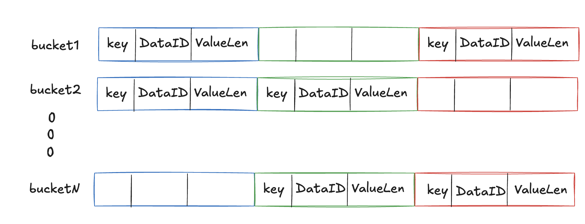

## Introduction

**bricksKV** is a high-performance key-value storage engine implemented in Rust.  
In simple terms, bricksKV can be seen as a **disk-based version of ConcurrentHashMap** — it supports serial writes and concurrent reads, achieving **O(1)** time complexity for reads.

The core design concept separates the storage of **keys** and **values**:

1. **Keys** are distributed into different index files based on their hash values. Each index entry stores both the key and the position of its corresponding value.
2. **Values** are stored in tiered files according to their size. Each file supports a fixed record length (e.g., 32B, 64B, 128B, etc.). Each value has an ID that marks its storage position.  
   During reads, the system locates the appropriate key bucket based on the key’s hash, retrieves the value ID, then directly locates and reads the corresponding value file.

---

## Design Philosophy

- **Key Storage**  
  LevelDB suffers from slow read performance because locating a key involves multiple steps: finding the right level, locating the correct file, opening it, reading the file index, and finally retrieving the value — potentially repeating this process across levels.

  In contrast, bricksKV takes a **hashmap-like** approach to store keys. Since file storage can’t use in-memory linked lists or arrays directly, bricksKV handles hash collisions by probing a limited number of slots (e.g., up to 32) after the hashed index. If the collision resolution fails, the bucket expands.  
  Using multiple buckets (e.g., 8192) reduces collision probability and the frequency of resizing operations.

- **Value Storage**  
  Write amplification in systems like LevelDB often arises from variable-length values that complicate resource management and require costly compaction or merging operations.  
  To address this, bricksKV uses **fixed-length data pages**, improving allocation and release efficiency.  
  Although real-world values are often variable-length, this issue is mitigated by using multiple tiers of fixed-length files — e.g., 32B, 64B, 128B, 256B, 512B, 1024B, 2048B, 4096B, etc.

  Each tier uses **multi-level bitmaps** to manage data page allocation and release.  
  Each bit in the upper-level bitmap manages 8 bits in the lower level:
  - `0` → indicates available space
  - `1` → indicates fully occupied space

---

## Architecture

### Persistent Layer
- **WAL (Write-Ahead Log)**:  
  Appends key-value pairs to disk for durability and crash recovery.
- **Key Store**:  
  Stores keys in buckets based on hash values.
- **Value Store**:  
  Manages fixed-length data page files categorized by value size.

### Memory Layer
- **KV Buffer**:  
  Temporarily holds newly written key-value pairs in memory before persistence.
- **KV Cache**:  
  Caches frequently accessed key-value data from the persistent layer. Configurable size for performance optimization.

---

## Core flow

- **Write Path**:  
  Data is first appended to the WAL, then written into the KV buffer, and finally into the KV cache.

- **Asynchronous Flush**:  
  When a WAL file exceeds a specified size (e.g., 4 MB), an asynchronous flush is triggered.  
  Each WAL file corresponds to one map in the KV buffer.  
  The system flushes each KV pair by first writing the value to the value store, then writing the key to the key store.  
  After flushing, the WAL file and its corresponding buffer map are deleted.

- **Read Path**:  
  Reads first check the KV buffer, then fall back to the key store and value store if not found.

---

## Core Module Design

### Persistent Layer

#### WAL (Write-Ahead Log)

The WAL stores data in an append-only format consisting of a 4-byte length field followed by a payload.  
It does not interpret data contents — it only tracks record lengths for sequential persistence and recovery.

#### Value Store

The value store manages multiple fixed-length data page files to handle values of different sizes.  
Each file is managed by multi-level bitmaps (`bitIndex`) — each bit in the upper level manages 8 bits in the lower level.  
A bit value of `0` indicates available space; `1` indicates full occupancy.

Examples of supported value sizes include **32B, 64B, 128B, 256B, 512B, 1024B, 2048B, 4096B**, etc.  
Values smaller than or equal to 32B are stored in the 32B file, those ≤64B in the 64B file, and so on.

Each data page has an incrementing **ID**, allowing direct offset calculation for fast reads.

Single-level data page file:

Multi-level data page files:

#### Key Store

The key store adopts a **ConcurrentHashMap-style** structure — keys are hashed into buckets, and within each bucket, the hash determines the index.  
Each record in the key store has a fixed size, containing:  
`key + value_id + value_length`.

Hash collisions are resolved via limited linear probing (e.g., up to 32 probes).  
If no free slot is found, the store expands — creating a larger file and migrating existing records, similar to a hashmap resize.

---

### Memory Layer

#### KV Buffer

The KV buffer ensures consistency before data is flushed to the key store and value store — similar to **LevelDB’s memtable**. each WAL file corresponds to one in-memory map in the buffer. once flushed to disk, both the WAL and the map are deleted.

#### KV Cache

The KV cache sits between the buffer and the persistent stores. It caches key-value data to reduce disk I/O and improve read performance. As a cache, it includes an eviction policy (e.g., **LRU**).

---

## Performance Analysis

- **Write**:  
  Sequential appends to the WAL file ensure efficient disk writes.

- **Read**:  
  Supports concurrent reads. If data exists in the KV cache, access is fast. Otherwise, the system locates the key through the key store using a hash lookup. even in the case of hash collisions, up to 32 probes (typically within a 4 KB region) are sufficient, often requiring just **one disk I/O**. Then, using the value ID, another I/O retrieves the value from the value store. Thus, **in most cases, a read can be completed in just two I/O operations** — even without cache hits, while maintaining **O(1) time complexity** for lookups.

---